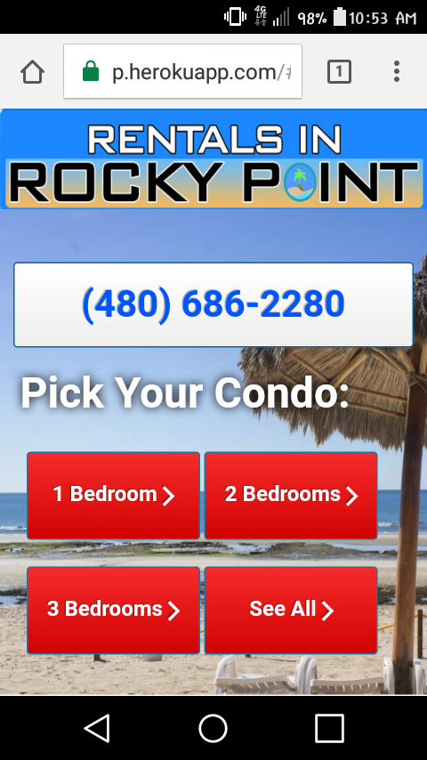
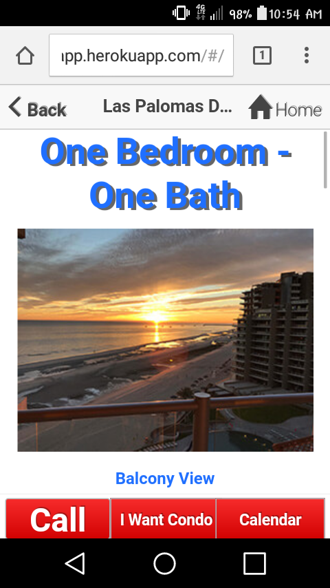

# Rental App made through Heroku using the `Heroku Mobile Template`

This application was made for the purpose of renting condos in Rocky Point.
The mobile app itself is a hybrid AngularJS app composed of HTML, CSS and Javascript. The
server side is implemented as an Express Node.js application running on top of 
a Postgres database.

## How to use

Options are made into buttons to check and see which condo is desired. 
The condos are organized into the "One Bedroom", "Two Bedrooms", "Three Bedrooms",
and "All" buttons.

Each Condo button links to a page to view the condos themselves as well as three buttons
on the bottom for more functionalities. The left-most button is the "Call" button which
allows the user to call in to book a reservation; the middle button is the "I Want Condo"
button, which links the user to a form that can be filled out to book the condo; the
right-most button is the "Calendar" button, this button links to a page which shows the
dates of which the condos are available as well as having the "Call" and "I Want Condo"
buttons, respectively at the bottom.

**Homepage screenshot**

**Condo page screenshot**

**Form page screenshot**

## Architecture

The app has two major pieces: An AngularJS based client app which comprises the front-end
which runs on the phone, and a Node.js backend which provides an API to the client app for 
user registration, data storage, and event broadcast.

    /---mobile app-----\
    | Ionic framework  |
    | Angular JS       |
    \------------------/
           |
           | http / websocket
           |
    /-------Node.js app-\
    |                   |
    | express           |
    |   bookshelf       |
    |      node-pg      |
    \-------------------/
           |
       [Postgres DB]

# Deployment

The app can be deployed to Heroku, and distributed to the mobile device either through
the mobile web browser, or by compiling the AngularJS application into a native app
using an Apache Cordova container.

# Understanding the code

The components of the application are organized as follows:

| component | folder |
|------------|---------|
| client app | client |
| ..app code | client/js |
| ..html templates | client/templates |
| ..ionic/angular frameworks | client/lib | 
|            |        |
| express app | server.js, server/* |
| ..db migrations | server/migrations |    
| ..question list | server/load_question.js |
| admin app  | admin  |

## Front-end app

The front-end app is an AngularJS single page application. Thus all the HTML and Javascripted
are loaded and run in a single WebView control on the phone. Different screens and navigation
are all drawn in the browser DOM.

Angular

# License

See LICENSE. This code is available under the MIT license.

